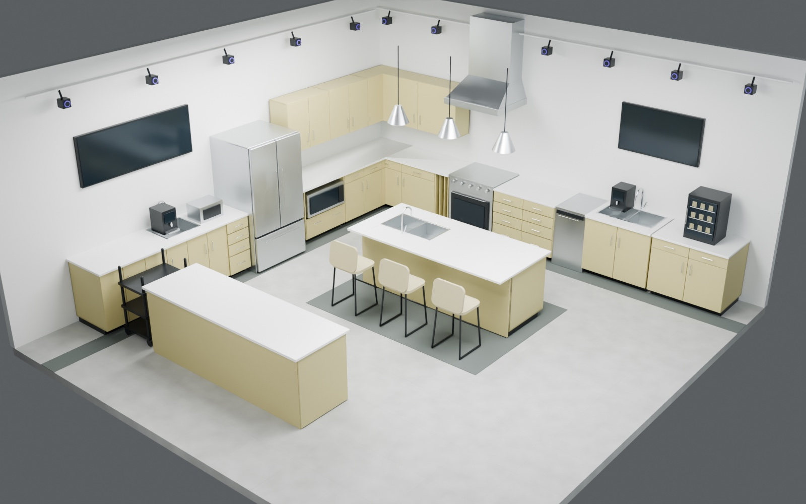
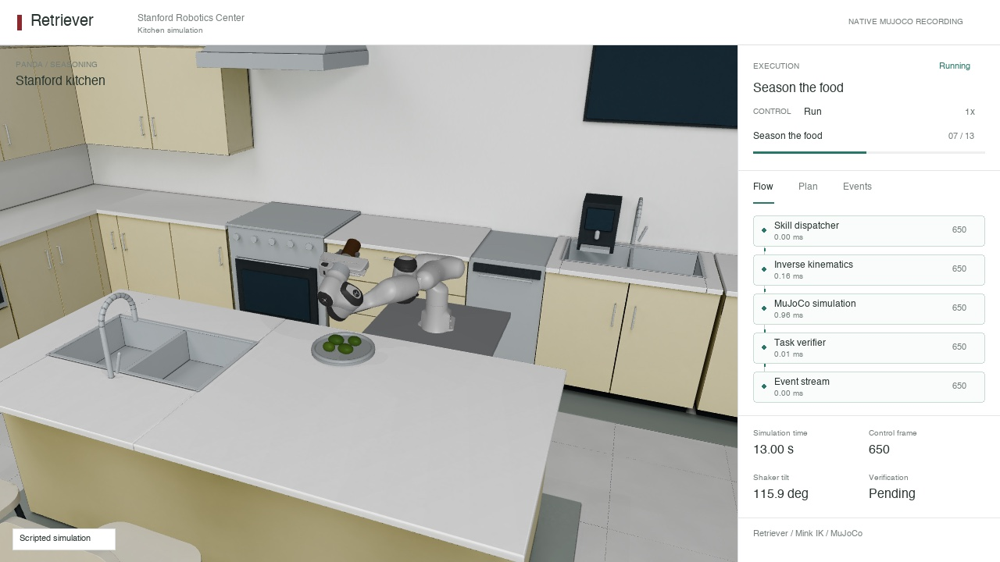
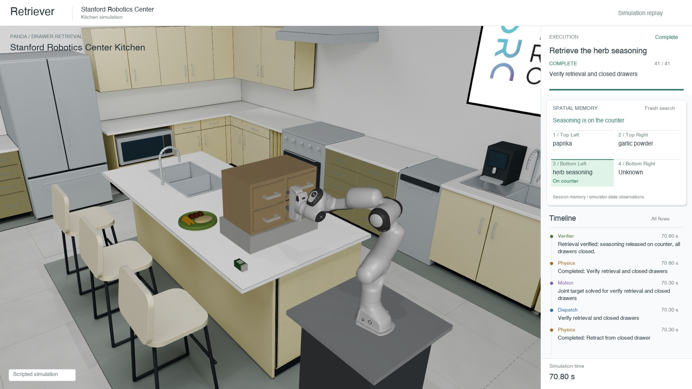

# Stanford Robotics Kitchen

An installable reconstruction of the Stanford Robotics Center kitchen for
MuJoCo and Retriever. The package includes the scene, portable robot assets,
scripted simulation tasks, and a five-Flow Retriever pipeline.



> This is an estimated visual reconstruction, not a surveyed digital twin.

## What Is Included

- Controllable Franka Panda and visual-only Mobile ALOHA staging
- 12 kitchen drawers and four tabletop organizer drawers
- Search, drawer, cup-transfer, and seasoning demonstrations
- Retriever pipeline: dispatch, inverse kinematics, simulation, verification,
  and events
- Local browser preview with pause, step, restart, timeline, and spatial memory

<table>
  <tr>
    <td></td>
    <td></td>
  </tr>
  <tr>
    <td align="center">Five-Flow seasoning pipeline</td>
    <td align="center">Drawer retrieval, memory, and verification</td>
  </tr>
</table>

## Quick Start

Requires Python 3.11, [uv](https://docs.astral.sh/uv/), and Git LFS.

```sh
git clone https://github.com/openretriever/stanford-robotics-kitchen.git
cd stanford-robotics-kitchen
git lfs pull
uv sync --extra preview --extra test
uv run stanford-robotics-kitchen verify
uv run stanford-robotics-kitchen preview
```

Open the printed local URL. The simulation starts paused. Recordings are written
to `runs/`.

## Retriever Pipeline

The Hub export builds the existing kitchen execution graph without starting a
clock, viewer, server, model request, or hardware connection.

```python
from retriever import hub

build = hub.use("openretriever/stanford-robotics-kitchen:pipeline")
pipeline = build(task="search")

print(pipeline.validate())
pipeline.kitchen_runtime.controls.set_paused(False)
pipeline.step(dt=0.02)
pipeline.close_stepper()
```

```text
skill_dispatcher
  -> inverse_kinematics
  -> mujoco_simulator
  -> task_verifier
  -> event_sink
```

Use `openretriever/stanford-robotics-kitchen:describe_pipeline` to inspect the
graph without loading Retriever, NumPy, or MuJoCo.

## Python API

```python
from retriever_src_kitchen import create_scene, describe_scene, scene_root

print(describe_scene())
print(scene_root())
model, data, spec = create_scene(robot="Panda")
```

`create_scene` constructs native MuJoCo state but starts no clock, policy, or
server. `create_demo("search")` creates the separate scripted demonstration.

## Harness Integration

Install this package in the Harness runtime alongside
`retriever_kitchen_sim`, then review and pin the scene fingerprint:

```sh
python -m retriever_kitchen_sim fingerprint "$(stanford-robotics-kitchen path)"
python -m retriever_kitchen_sim doctor "$(stanford-robotics-kitchen path)" \
  --expected-source-digest REVIEWED_SHA256
```

Pass that reviewed digest to `harness_config(REVIEWED_SHA256)`. The consuming
Harness remains responsible for task authorization and execution admission.

## Scope And Safety

- No real-device or hardware access
- No model provider or API credentials
- No implicit simulator, viewer, socket, or network startup during import
- Mobile ALOHA geometry is visual-only and based on AgileX's public simulation
  variant, not an exact model of the original Stanford hardware
- Scripted search contains target knowledge; it is a demonstration, not a
  general object-search evaluation

Use a fresh simulator process when switching scene snapshots. The tested stack
pins MuJoCo 3.3.1 and Retriever Core 0.0.4.

## Development

```sh
uv run pytest
uv run python tools/check_repository.py
uv build
```

After changing packaged scene resources, regenerate the reviewed inventory with
`tools/write_asset_manifest.py`.

## Distribution

This private repository is shared through the OpenRetriever organization for
approved collaborators. Pin a reviewed release or commit and use Git LFS when
cloning. Repository access does not grant public redistribution rights.

See [LICENSE](LICENSE) and [THIRD_PARTY.md](THIRD_PARTY.md). There is no blanket
open-source license for the reconstruction or brand assets.
